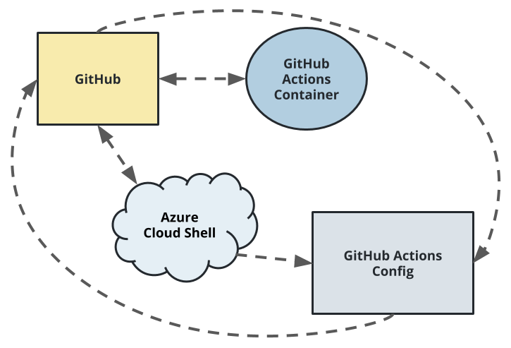

# Overview

In this project, I built a Github repository from scratch and created a scaffolding that assisted me in performing both Continuous Integration and Continuous Delivery. I used Github Actions along with a Makefile, requirements.txt and application code to perform an initial lint, test, and install cycle. Next, I integrated this project with Azure Pipelines to enable Continuous Delivery to Azure App Service.

## Project Plan

* A link to a [Trello](https://trello.com/invite/b/nQ1YXymx/ATTIf919d539bd4a48573232b7e7e532c87459298484/project-management) board for the project
* A link to a [spreadsheet](https://docs.google.com/spreadsheets/d/1FH4DlHbekuHPKbjYGb84ZCZzjj-oKbDDoqqklHm8JzY/edit?usp=sharing) that includes the original and final project plan>

## Instructions

* Architectural Diagram 

Instructions for running the Python project.  How could a user with no context run this project without asking you for any help.  Include screenshots with explicit steps to create that work. Be sure to at least include the following screenshots:

1. Login in your Azure account
2. From the Azure Console, open the Cloud Shell (Bash) terminal
3. Generate and set up SSH Keys in your azure cloud shell, add them (id_rsa.pub) to your GitHub repository and then clone the project there.
  ssh-keygen -t rsa
  cat ~/.ssh/id_rsa.pub
  git clone <repository>
   

* Project running on Azure App Service

* Project cloned into Azure Cloud Shell

* Passing tests that are displayed after running the `make all` command from the `Makefile` with a test run

* Successful deploy of the project in Azure Pipelines and running it.

* Successful prediction from deployed flask app in Azure Cloud Shell.  [Use this file as a template for the deployed prediction](https://github.com/udacity/nd082-Azure-Cloud-DevOps-Starter-Code/blob/master/C2-AgileDevelopmentwithAzure/project/starter_files/flask-sklearn/make_predict_azure_app.sh).

* Output of streamed log files from deployed application

## Enhancements

More emphasis should be given to debugging applications through log files, after I started doing it I took minutes on what took hours before.
## Locust testing
- Execute a Load Testing, running Locust with `./locust.sh`.

## Demo 

A link to a [Screencast](https://www.youtube.com/watch?v=E4mO23dOGpE) on YouTube!

